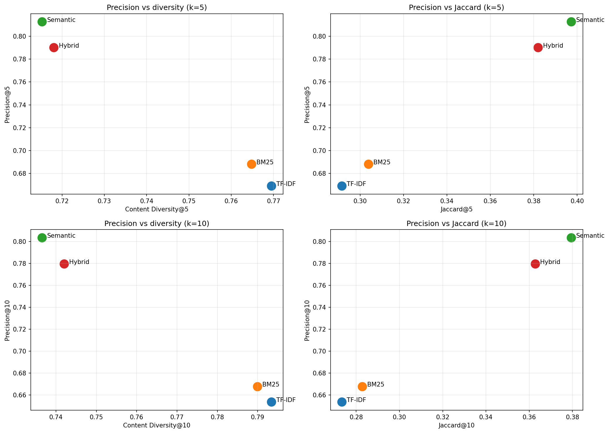

## ML based movie recomendation system 
Collaborative filtering often dominates modern movie recommendation systems but requires extensive user data, while simpler content based methods rely on shallow metadata (like matching ratings and keyword). 

This project is about a content based alternative using only movie overview summaries. The goal is to automatically recommend $K$ relevant movies given a single movie from a dataset. The project compares sparse retrieval ([TF-IDF](https://scikit-learn.org/stable/modules/generated/sklearn.feature_extraction.text.TfidfVectorizer.html), [BM25](https://pypi.org/project/rank-bm25/)), dense retrieval ([SBERT](https://www.sbert.net) and [Embeddinggemma](https://huggingface.co/google/embeddinggemma-300m)), and a hybrid approach.

## Report
[report.pdf](report.pdf)
## Result

Dense retreival with [Embeddinggemma](https://huggingface.co/google/embeddinggemma-300m) (named "Semantic" in the plots below) gave best relevance results with much better precision but sparse methods offered more diversity.

